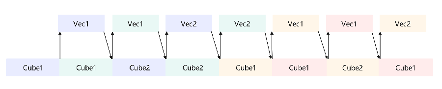

声明：本文使用[Creative Commons License version 4.0](https://creativecommons.org/licenses/by/4.0/legalcode)许可协议，转载、引用或修改等操作请遵循此许可协议。

# PromptFlashAttention算子设计介绍

为不断优化提升增量推理性能, 提出支持全量推理的PromptFlashAttention融合算子需求。

## 1 实现原理

按照flashAttention正向计算流程实现, 整体计算流程如下：

1. query与转置后的key做matmul计算后得到最初步的attention_score, 然后与位置编码pse相加后再乘以缩放系数scale_value。此时的结果通过atten_mask进行select操作, 将atten_mask中为true的位置进行遮蔽, 得到结果masked_attention_score, 即atten_mask中为true的位置在select后结果为负的极小值, 经过softmax计算之后变成0从而达到遮蔽效果。

2. 为了实现FlashAttention加速算法, 使用FlashSoftmax操作对masked_attention_score进行运算, 用以代替原公式中的softmax运算, 而后将结果与value做matmul运算。由于FlashSoftmax操作对masked_attention_score的Skv(输入key、value的sequence length)方向进行了切分, 故实现过程中存在一个刷新流程, 具体如下：

   1. 每次FlashSoftmax计算只对切分后的一个SkvSplit（SkvSplit是针对Skv轴进行切分之后的序列长度的简称）进行操作, 并从第二次循环开始记录exp, 其中 i 表示Skv切分后的循环变量, 针对exp的i是从1开始 , exp的计算公式如下：
      $$
      exp[i] = e^{max_{i - 1} - max_{i}}
      $$

   2. 从i = 1开始, 需要增加Mul和Add操作, 即将上一次的MM[PV]的结果和当前exp相乘, 相乘完的结果和本次MM[PV]的结果相加得到的结果保存到GM中。以此类推, 遍历Skv计算完成。

   3. 由于FlashSoftmax计算中的除sum被后移到输出attention_out之前, 因此最后需要将ub中的attention_out按行除以softmax_sum并将最终完整的结果保存到输出内存attention_out(Final)上。

## 2 模板化设计

### 2.1 模板类型

为了使不同的输入可以复用相同的tiling和流水，采用了模板的方式来实现融合算子，但是不同的输入全部使用同一套模板时又无法达到性能最优和功能泛化，因此需要根据输入shape的特征区分不同的模板来实现。融合算子的多模板设计思路主要为：

1. 根据产品形态划分的通用能力模板：
（1）A2/A3场景通用能力模板，支持Atlas A2 训练系列产品/Atlas 800I A2 推理产品/A200I A2 Box 异构组件/Atlas A3 训练系列产品/Atlas A3 推理系列产品。
(2) 针对Atlas 推理系列加速卡产品，是能通用能力模板。

2. 根据特定业务场景开发模板：
（1）针对MLA场景，开发MLA基础API模板。
（2）在A2/A3环境，针对独立接口，图模式且D非32对齐场景，支持特殊模板实现。
（3）对于输入的key/value/attentionOut矩阵某一轴维度为0，提供空Tensor模板。

### 2.2 数据切分

  由于硬件buffer大小是有限的，而计算的数据量又是巨大的，无法一次计算完，那么就需要进行tiling切分，shape不同会导致算子的切分轴不同，而算子的切分轴，会影响模板的功能及性能。往往需要根据切分轴进行模板拆分，模板拆分时为了达到性能最优，需要考虑如下几个点：

  a. 将核心的数量用满，防止部分核闲置 

  b. 每一个核心被分配的计算量相对均匀，避免出现某些核计算的数据量过大，其余核在围观的情况。

  c. AIC和AIV之间处理的数据量要符合其对应的算力，避免AIC或AIV出现长时间的空闲。 

  PromptFlashAttention算子包含B、N2(key和value的N)、G(query_N/kv_N)、S1(query的S)、S2(key和value的S)共5个轴，切分顺序是先核内再核间，核内切分依据基本块大小选择切分轴，核间切分是把核内切分后剩余的轴合并后依据AI Core核数再进行切分。

## 3 tiling设计

Tiling操作的目的是为了找到一种更高效的NPU执行方式，原始的数据量一般是非常大的，没有办法通过一次指令调用就完成所有计算，因此需要将数据量分到多个核上并行计算，且每个核上也需要考虑如何循环计算性能最优，不同的输入可能有不同的最优执行方式，所以需要通过tiling策略决定怎么将数据分配到各个核上进行计算。

### 3.1 CV Tiling分离设计

 根据硬件架构特征，AI Core分成AIC和AIV两个独立的核，AIC和AIV核拥有自己独立的Scalar计算单元，能够独立加载自己的代码段，单独执行。AIC和AIV分离的架构可以使得AIC和AIV并行执行。AIC和AIV之间数据交互的通路是L2和HBM（High Bandwidth Memory，高带宽存储器），两者之间的交互次数对性能影响是比较大的，同时由于AIC和AIV算力差异，两者需要使用不同的基本块大小，本着尽量减少AIC和AIV通信次数和发挥最大算力的原则，CVtiling分离策略应运而生，可以有效地减少CV通信次数，同时根据不同单元的buffer特征，选择不同的基本块进行计算，从而提升算子性能。

 对于PromptFlashAttention算子，Vector计算涉及多个输入、输出、中间计算结果、double-buffer设计等，需要将buffer分配成多份，最优分配方案中最大一份为32KB，由于Vector计算使用的数据类型是float32，因此Vector的tiling基本块为8 * 1024。为了充分发挥Cube的算力，在CV之间一轮计算的数据量进行了1:16的配比，又由于Cube侧的输入数据类型是float16，输出是float32，cube的基本块为128 * 128，所以通过nRation=8配比出128 * 1024的数据量。伪码如下：

### 2.2 tilingkey设计

为了在运行态实例化一个确定的模板，需要通过tilingkey来唯一标识 。

**tilingKey生成规则**：按十进制位组装tilingkey，初始值为0，每个属性/功能对应不同的魔数，依次累加得到tiling key。

PFA算子tiling key设计如下：
在Atlas 推理系列加速卡产品场景：
> **1.** 魔数12288作为当前场景的标识。
> **2.** 根据输入的query/key/value矩阵的layout区分，BNSD：+10000。
> **3.** 根据配置的精度模式区分，输入FP16且高精度模式：+600。

在A2/A3场景：
> **1.** 当输入的query矩阵是FP16/BF16类型，且D轴无尾块时
> （1）魔数1012作为当前场景标识。
> （2）根据输入数据类型划分，输入的query矩阵为FP16且配置高精度模式，或输入的query矩阵为FP16类型，key/value为INT8类型且开启MSD为量化：+600；输入的query矩阵为BF16类型：+100。
> （3）根据输出数据类型划分，输出BF16：+10000；输出INT8：+20000；其他：+0。
> （4）根据输入的layout划分，输入BSH/BSND格式：+100000。
> （5）根据分核方式划分，使用SPLIT_NBS_CUBE/SPLIT_ONEN_CUBE：+2000000。
> （6）输入的query矩阵为FP16类型，key/value为INT8类型且未开启MSD为量化：+800000000000。
> **2.** 当输入的query矩阵不是FP16/BF16类型，或D轴有尾块时
> （1）魔数10作为当前场景表示。
> （2）根据输入的layout划分，BNSD格式：+5。
> **3.** 其他功能叠加
> （1）开启PagedAttention：+10000000U。
> （2）开启Prefix共享前缀：+100000000。
> （3）开启MSD伪量化：+400200000000。

**其余特化场景，可以依次在后面定义自己的位域和值。**

## 3 流水设计

为了追求极致性能，必须充分利用硬件资源，通常需要进行不同pipeline的流水设计。流水设计的宗旨是尽量使某一条pipeline达成bound效果，使硬件的某一个单元一直在工作，达到性能上限。

### 3.1  V侧流水

V侧流水设计需要考虑Vector内部的搬运及计算过程，实施的优化手段主要是double buffer。
以下面的流水任务示意图为例，Vec的功能被拆分成2个流水任务：subA、subB，每个任务专注于完成单一功能；需要处理的数据被切分成2片，使用ping-pong表示两个数据处理任务，每个任务需要依次搬运DataCopy与计算Clc操作。任务间的箭头表达数据间的依赖关系，比如subA处理完DataCopy之后，subB才能对Clc进行处理。
从图上可以看出，不进行流水设计时，搬运与计算任务之间是串行执行的，会出现断流现象，即第一次DataCopy完成之后的搬运流水就一直处于空闲状态，直到第一次搬入的数据计算完成并搬出之后搬运流水才会继续工作，进行第二次DataCopy（Vector计算和搬出流水也存在同样问题）。通常这种情况下，性能是极差的。

将上图的流水任务做ping-pong流水间的double buffer处理后，流水任务运行起来的示意图如下，从运行图中可以看出，对于同一片数据，搬运DataCopy与计算Clc之间的处理具有依赖关系，需要串行处理；不同的数据切片，同一时间点，可以有多个任务在并行处理，由此达到任务并行、提升性能的目的。

实现伪码如下：

```python
def Vec():
    subA(ping) # 表示计算ping小块
    subA(pong) # 表示计算pong小块
    subB(ping) # 表示计算ping小块
    subB(pong) # 表示计算pong小块
```

其中ping、pong两块计算数据所占用的内存资源均相互独立。
​PromptFlashAttention类融合算子V侧计算过程较多，情况也比较复杂，通常简单的double buffer是无法覆盖所有情况的，因此会出现不同的计算流水排布。不同的计算流水适用于不同类的shape特征，以达到在该类特征下最好的流水设计。

### 3.2 CV流水


融合算子通常包含了Vector计算和Cube计算，对于PromptFlashAttention算子，V侧的计算是依赖C侧的计算结果的，如果只关注V侧流水，不关注C侧，则C侧与V侧很有可能是串行流水的效果，不能达到并行计算的目的，无法使得融合算子性能达到最优，从而有了CV流水设计。此外，CV流水在不同算子情况下，表现的现象也是不一致的，PromptFlashAttention的Cube双发机制可实现两种场景下的流水优化：

- C侧总耗时 > V侧总耗时

  该场景流水特征下，Vector计算节点少，计算速度快，在<term>Atlas A2 训练系列产品/Atlas 800I A2 推理产品/A200I A2 Box 异构组件</term> C:V=1:2的情况下，Cube的搬运时长足以掩盖Vector的计算时长，因此只要关注Cube的MTE2耗时即可，最终达成MTE2 bound。在Cube双发机制下，提前发射两块Cube计算，Cube1、Cube2计算可以衔接，使得Cube利用率最高，达成Cube bound。

 融合算子通常包含了Vector计算和Cube计算，对于FA算子，V侧的计算是依赖C侧的计算结果的，如果只关注V侧流水，不关注C侧，则C侧与V侧很有可能是串行流水的效果，不能达到并行计算的目的，无法使得融合算子性能达到最优，从而有了CV流水设计。此外，CV流水在不同算子情况下，表现的现象也是不一致的，FA的Cube双发机制可实现流水优化：

  该场景流水特征下，Vector计算节点少，计算速度快，在<term>Atlas A2 训练系列产品</term> C:V=1:2的情况下，Cube的搬运时长足以掩盖Vector的计算时长，因此只要关注Cube的MTE2耗时即可，最终达成MTE2 bound。在Cube双发机制下，提前发射两块Cube计算，Cube1、Cube2计算可以衔接，使得Cube利用率最高，达成Cube bound。

  

- C侧总耗时 < V侧总耗时 

  该场景流水特征下，Vector计算节点多，Vector计算是瓶颈，C侧的搬运不足以掩盖V侧的流水，因此需要进行CV流水排布，尽量达到CV并行的效果，最通用的优化手段是C侧提前发射。

  C侧连续发射两块Cube计算，这样可以保证V侧计算完上一轮时，可以立马启动当前轮的计算，而不用等待Cube1的数据。这样可以使V侧一直在工作，达成Vector bound。