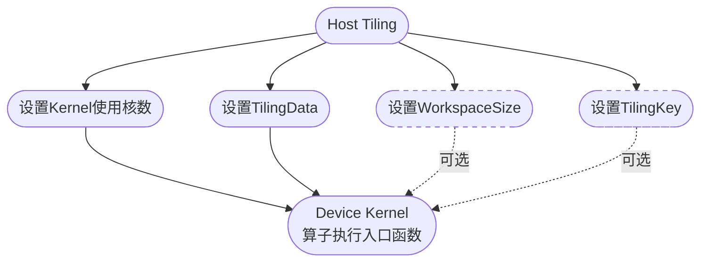

# AI Core算子开发指南

> 说明：算子开发过程中涉及的基本概念如Tiling、Kernel、Ascend C接口等，详细介绍请参考[《Ascend C算子开发》](https://hiascend.com/document/redirect/CannCommunityOpdevAscendC)。

开发指南以`AddExample`算子开发为例，介绍新算子开发流程以及涉及的交付件，流程图如下，完整样例代码请访问项目`examples`目录。


1. [前提条件](#前提条件)：

   ① 环境部署：开发算子前，请确保基础环境已安装，例如依赖的驱动、固件、CANN软件包等。 

   ② 算子设计：分析实际业务诉求，合理设计算子规格，包括算子输入、输出、属性的数据类型、shape等。

2. [工程创建](#工程创建)：开发算子前，需按要求创建算子目录，方便后续算子的编译和部署。

3. [Tiling实现](#Tiling实现)：实现Host侧算子Tiling函数。

4. [Kernel实现](#Kernel实现)：实现Device侧算子核函数。

5. [aclnn适配](#aclnn适配)：自定义算子推荐aclnn接口调用，需完成二进制发布。如需入图，请参考[附录](#附录)。

6. [编译部署](#编译部署)：通过工程编译脚本完成自定义算子的编译和安装。 

7. [算子验证](#算子验证)：通过常见算子调用方式，验证自定义算子功能。  


##  前提条件
**1. 环境部署**

开发算子前，请参考[环境准备](./quick_op_invocation.md#环境准备)完成环境搭建。

**2. 算子设计**

确定目标算子的功能和计算逻辑，并将数学计算逻辑转化为可执行的代码逻辑。以自定义`AddExample`算子设计为例，设计步骤如下：


`AddExample`算子设计规格如下：

<table>
<tr>
<th>算子类型</th>
<td colspan="4" align="center">AddExample</td>
</tr>
<tr>
<th>算子表达式</th>
<td colspan="4" align="center">y[i] = x1[i] + x2[i] </td>
</tr>
<tr>
<th rowspan="3" >算子输入</th>
<th>name</th>
<th>shape</th>
<th>dataType</th>
<th>format</th>
</tr>
<tr>
<td>x1</td>
<td>(32,4,4,4)</td>
<td>float/int32</td>
<td>ND</td>
</tr>
<tr>
<td>x2</td>
<td>(32,4,4,4)</td>
<td>float/int32</td>
<td>ND</td>
</tr>
<tr>
<th>算子输出</th>
<td>y</td>
<td>(32,4,4,4)</td>
<td>float/int32</td>
<td>ND</td>
</tr>
<tr>
<th rowspan="5" align="top">关键接口（Ascend C）</th>
</tr>
<tr>
<td colspan="4" >DataCopy：数据搬移接口</td>
</tr>
<tr>
<td colspan="4" >Add：矢量双目指令接口</td>
</tr>
<tr>
<td colspan="4" >AllocTensor、FreeTensor：内存管理接口</td>
</tr>
<tr>
<td colspan="4" >EnQue、DeQue：Queue队列管理接口</td>
</tr>
<tr>
<th rowspan="5" >算子实现文件</th>
<td colspan="4" >add_example.h</td>
</tr>
</table>


## 工程创建

工程创建是算子开发的重要步骤，为后续代码编写、编译构建和调试提供统一的目录结构和文件组织方式。

本项目`build.sh`，支持快速创建算子目录。进入项目根目录，执行以下命令：

```bash
# 创建指定算子目录，如bash build.sh --genop=examples/add_example
bash build.sh --genop=${op_class}/${op_name}
```
- \$\{op_class\}表示算子类型，如transformer类。
- \$\{op_name\}表示算子名的小写下划线形式，如`AddExample`算子对应为add\_example。

如果命令执行成功，会看到如下提示信息：

```bash
Create the initial directory for ${op_name} under ${op_class} success
```
创建完成后，目录结构如下所示：

```
${op_name}                              # 替换为实际算子名的小写下划线形式
├── op_host                             # Host侧实现
│   ├── ${op_name}_def.cpp              # 算子信息库，定义算子基本信息，如名称、输入输出、数据类型等
│   ├── ${op_name}_infershape.cpp       # InferShape实现，实现算子形状推导，在运行时推导输出shape
│   ├── ${op_name}_tiling.cpp           # Tiling实现，将张量划分为多个小块，区分数据类型进行并行计算
│   └── CMakeLists.txt                  # Host侧cmakelist文件
└── op_kernel                           # Device侧Kernel实现
│   ├── ${op_name}_tiling_key.h         # Tilingkey文件，定义Tiling策略的Key，标识不同的划分方式
│   ├── ${op_name}_tiling_data.h        # Tilingdata文件，存储Tiling策略相关的配置数据，如块大小、并行度
│   ├── ${op_name}.cpp                  # Kernel入口文件，包含主函数和调度逻辑
│   └── ${op_name}.h                    # Kernel实现文件，定义Kernel头文件，包含函数声明、结构定义、逻辑实现
├── op_graph                            # 图融合相关实现
│   ├── CMakeLists.txt                  # op_graph侧cmakelist文件
│   ├── ${op_name}_graph_infer.cpp      # InferDataType文件，实现算子类型推导，在运行时推导输出dataType
│   └── ${op_name}_proto.h              # 算子原型定义，用于图优化和融合阶段识别算子
└── CMakeLists.txt                      # 算子cmakelist入口
```

使用上述命令行创建算子工程后，若要手动删除新创建出的算子工程，需要同时删除与算子工程同目录CMakeLists.txt中新添加的add_subdirectory(${op_class})

## Tiling实现

### Tiling简介

因NPU中AI Core内部存储空间有限，无法一次性将整个张量数据加载到计算单元中处理，因此需要将输入张量切分为多个小块（Tile），逐块进行计算，这一过程称为Tiling。

用于指导数据切分的算法称为Tiling策略或Tiling算法，其决定了如何将输入数据切分为多个计算块，并指导Kernel如何分配内存、调度计算任务。Tiling与Kernel之间通过`TilingData`结构体进行信息传递。

Tiling流程如下图所示：


### 代码实现

**1. 通过Tiling入参获取算子规格/环境信息**

Tiling实现第一步，需要从输入参数中获取算子的规格信息和运行环境信息，包括可用核数、UB（Unified Buffer）大小、输入张量的shape和数据类型等。

```CPP
// 获取平台信息
fe::PlatFormInfos* platformInfoPtr = context->GetPlatformInfo();
OP_CHECK_NULL_WITH_CONTEXT(context, platformInfoPtr);

// 创建Ascend C平台对象
auto ascendcPlatform = platform_ascendc::PlatformAscendC(platformInfoPtr);

// 获取可用核数
coreNum = ascendcPlatform.GetCoreNumAiv();

// 获取UB缓冲区大小
ascendcPlatform.GetCoreMemSize(platform_ascendc::CoreMemType::UB, ubSize);

// 获取输入张量shape信息
auto inputX = context->GetInputShape(0);
OP_CHECK_NULL_WITH_CONTEXT(context, inputX);

// 如果输入shape是标量，转换为{1}，否则保持原shape不变
auto inputShapeX = EnsureNotScalar(inputX->GetStorageShape());

// 获取输入张量的描述信息
auto inputDesc = context->GetInputDesc(0);
OP_CHECK_NULL_WITH_CONTEXT(context, inputDesc);

// 获取数据类型
dataType = inputDesc->GetDataType();
```

**2. 合法性校验**

获取到算子规格和环境信息后，需要对这些信息进行合法性校验，确保后续Tiling算法和Kernel实现可以正常运行。

```CPP
// 指针非空校验
OP_CHECK_NULL_WITH_CONTEXT(context, inputDesc);

// shape校验
OP_CHECK_IF(
    inputShapeX.GetDimNum() != DIMS_LIMIT || inputShapeY.GetDimNum() != DIMS_LIMIT ||
        outShapeZ.GetDimNum() != DIMS_LIMIT,
    OP_LOGE(
        context, "AddExample: inputx,inputy,outputz shape dim = %zu, %zu, %zu, should be equal 4",
        inputShapeX.GetDimNum(), inputShapeY.GetDimNum(), outShapeZ.GetDimNum()),
    return ge::GRAPH_FAILED);

// 数据类型校验
// 支持的数据类型集合
const std::set<ge::DataType> supportedDtype = {ge::DT_FLOAT, ge::DT_INT32};

// 获取输入数据类型
auto inputDesc = context->GetInputDesc(0);
OP_CHECK_NULL_WITH_CONTEXT(context, inputDesc);

// 校验数据类型是否在支持范围内
dataType = inputDesc->GetDataType();
if (supportedDtype.count(dataType) == 0) {
    OP_LOGE(context, "invalid dtype");
    return ge::GRAPH_FAILED;
}
```

**3. Tiling策略设计**

Tiling算法目标如下：

- 充分利用硬件资源：通过多核并行和块级并行，提高计算效率。
- 合理分配内存：根据每个Tile大小，合理分配UB内存。
- 保证计算正确性：确保每个Tile计算逻辑与整体逻辑一致，结果正确。

本样例`AddExample`算子输入张量shape为 (32, 4, 4, 4)， 总元素个数为2048。为充分利用硬件资源，设计的Tiling策略：

- 启用8个核（coreNum=8）计算。
- 每个核内部将数据分为8块（tileNum=8），实现更细粒度并行。
- 总数据量2048个元素，每个核处理2048/8=256个元素。
- 每个核内部将256个元素划分为8块，每块处理32个元素。
- （可选）对支持的数据类型，通过TilingKey指定不同的Kernel分支。

**4. Tiling算法实现**

Tiling策略需要与Kernel实现紧密配合，Tiling负责指导Kernel的内存分配和张量切分，Kernel则根据Tiling提供的信息进行计算调度。Tiling与Kernel之间信息传递通过`TilingData`结构体完成。

在Tiling实现过程中，需要完成如下关键操作：




- **设置Kernel使用核数**

  Host侧Tiling实现时，需要设置Kernel执行所使用的核数（即并行度），通过`SetBlockDim`接口设置。

- **设置TilingData信息**
  根据Tiling策略，需要将如下信息传递给Kernel，样例算子的TilingData结构体信息为：

  - 总数据量大小： totalLength
  - 每个核数据切块数量：tileNum

- **设置WorkspaceSize（可选）**

  如果算子在执行过程中需要额外的临时内存（workspace），可在Tiling中设置其大小。请根据实际需求决定是否使用。

- **设置TilingKey（可选）**

  对于复杂算子，Kernel可能需要根据不同Tiling策略选择不同的执行路径。请根据实际需求设置TilingKey，标识不同的分支策略。

先在\$\{op\_name\}\_tiling\_data.h中定义TilingData结构体，存储Tiling策略数据（如块大小），示例如下，`AddExample`算子完整代码请参考`examples/add_example/op_kernel`下[add_example_tiling_data.h](../../examples/add_example/op_kernel/add_example_tiling_data.h)。

```CPP
// 定义TilingData结构体
struct AddExampleTilingData {
     int64_t  totalLength;     // 输入张量总元素个数
     int64_t  tileNum;        // 每个核内部数据切块数量
};
```
再在\$\{op\_name\}\_tiling.cpp实现关键操作代码，代码如下，`AddExample`算子完整代码请参考`examples/add_example/op_host`目录下[add_example_tiling.cpp](../../examples/add_example/op_host/add_example_tiling.cpp)。

```CPP
// 设置Kernel使用核数
context->SetBlockDim(BLOCK_DIM);        // BLOCK_DIM表示启用的核数量

// 设置TilingData信息
AddExampleTilingData* tiling = context->GetTilingData<AddExampleTilingData>();
OP_CHECK_NULL_WITH_CONTEXT(context, tiling);
OP_CHECK_IF(
    memset_s(tiling, sizeof(AddExampleTilingData), 0, sizeof(AddExampleTilingData)) != EOK,
    OP_LOGE(context, "set tiling data error"), return ge::GRAPH_FAILED);
tiling->totalLength = totalIdx;
tiling->tileNum = TILE_NUM;

// 设置WorkspaceSize（可选）
size_t* currentWorkspace = context->GetWorkspaceSizes(1);
OP_CHECK_NULL_WITH_CONTEXT(context, currentWorkspace);
currentWorkspace[0] = WS_SYS_SIZE;

// 设置TilingKey（可选）
// 不同dtype走不同的Tiling key分支
if (dataType == ge::DT_FLOAT) {
    tilingKey = GET_TPL_TILING_KEY(ELEMENTWISE_TPL_SCH_MODE_0);
    context->SetTilingKey(tilingKey);
} else if (dataType == ge::DT_INT32) {
    tilingKey = GET_TPL_TILING_KEY(ELEMENTWISE_TPL_SCH_MODE_1);
    context->SetTilingKey(tilingKey);
} else {
    OP_LOGE(context, "get dtype error");
    return ge::GRAPH_FAILED;
}
```
注意，TilingKey可通过模板化编程实现，示例代码如下，完整代码请参考`examples/add_example/op_kernel`下[add_example_tiling_key.h](../../examples/add_example/op_kernel/add_example_tiling_key.h)。

```C++
#define ELEMENTWISE_TPL_SCH_MODE_0 0
#define ELEMENTWISE_TPL_SCH_MODE_1 1

// 1、定义模板参数
ASCENDC_TPL_ARGS_DECL(AddExample,               // 算子OpType
    ASCENDC_TPL_UINT_DECL(schMode, 1, ASCENDC_TPL_UI_LIST, ELEMENTWISE_TPL_SCH_MODE_0, ELEMENTWISE_TPL_SCH_MODE_1)                    // schMode支持的值选项
);

// 定义模板参数组合
ASCENDC_TPL_SEL(
    // 组合1：样例只区分数据类型，故这里只有一个选项
    ASCENDC_TPL_ARGS_SEL(
        ASCENDC_TPL_UINT_SEL(schMode, ASCENDC_TPL_UI_LIST, ELEMENTWISE_TPL_SCH_MODE_0, ELEMENTWISE_TPL_SCH_MODE_1)));
#endif
```

如需实现复杂参数组合完成分支选择（涉及多TilingKey场景），请参考[《Ascend C算子开发》](https://hiascend.com/document/redirect/CannCommunityOpdevAscendC)中"算子实现 > Host侧Tiling实现 >  Tiling模板编程"。

## Kernel实现

### Kernel简介
Kernel是算子在NPU执行的核心部分，负责张量数据的加载、计算和存储，是算子功能实现的最终载体。Kernel的实现需要与Tiling策略紧密配合，根据Tiling提供的`TilingData`、`TilingKey`信息进行内存分配和计算调度。

Kernel实现包括如下步骤，整个流程通过`Process`函数串联，实现完整的算子流程。


1. 核函数定义

   Kernel实现的第一步，需要定义Kernel入口函数，在该函数中获取TilingData信息，并根据TilingKey选择不同的Kernel分支。

2. 定义Kernel类

   核函数会根据不同Tiling key实例化对应Kernel类，并调用`Init`、`CopyIn`、`Compute`、`CopyOut`和`Process`等核心函数完成计算。

3. 初始化函数Init

   Kernel类定义完成后，需要实现`Init`函数，该函数负责设置输入输出地址、计算每个Tile大小，并初始化输入输出队列，为后续数据搬入和计算做准备。

4. 主处理函数Process

   初始化完成后，进入主处理函数`Process`，该函数是整个Kernel的执行入口，通过循环调用`CopyIn`、`Compute`和`CopyOut`，实现数据的搬入、计算和搬出，完成整个算子的执行流程。

5. 数据搬入CopyIn

   在`Process`函数中，首先调用`CopyIn`函数，该函数负责将数据从Global Memory（GM）拷贝到Local Memory（LM），并将数据入队列，为后续计算做准备。

6. 计算Compute

   在数据搬入完成后，调用`Compute`函数，该函数负责执行算子的核心计算逻辑，如加法操作。计算结果将被写入输出队列，等待后续搬出。

7. 数据搬出CopyOut

   在计算完成后，调用`CopyOut`函数，该函数负责将计算结果从Local Memory（LM）拷贝回Global Memory（GM），并释放Local Memory（LM），完成当前Tile处理。

### 代码实现

根据上述步骤编写Kernel入口文件\$\{op\_name\}.cpp ，包含主函数和调度逻辑，示例如下，`AddExample`算子完整代码请参考`examples/add_example/op_kernel`下[add_example.cpp](../../examples/add_example/op_kernel/add_example.cpp)。

```CPP
// 1、核函数定义
// schMode是一个模板参数，用于支持不同数据类型（如float和int32）的计算路径
// __global__ __aicore__表示该函数是个全局函数，可以在AI Core上执行
template <uint32_t schMode>
__global__ __aicore__ void add_example(GM_ADDR x, GM_ADDR y, GM_ADDR z, GM_ADDR workspace, GM_ADDR tiling){
    ....
    // Tiling注册入口
    REGISTER_TILING_DEFAULT(AddExampleTilingData);

    // 宏方式获取TilingData
    GET_TILING_DATA_WITH_STRUCT(AddExampleTilingData, tilingData, tiling);

    // 根据TilingKey实例化Kernel对象并完成计算
    if constexpr (schMode == static_cast<uint32_t>(AddExampleTilingKey::TILING_KEY_EXAMPLE_FLOAT)) { // float数据类型走该分支
        NsAddExample::AddExample<float> op;     // 算子Kernel实例获取
        op.Init(x, y, z, &tilingData);          // 算子Kernel实例初始化
        op.Process();                           // 算子Kernel实例执行
    }
    ....
}
```
在\$\{op\_name\}.h中定义Kernel头文件，包含函数声明、结构定义、逻辑实现等，示例如下，`AddExample`算子完整代码请参考`examples/add_example/op_kernel`下[add_example.h](../../examples/add_example/op_kernel/add_example.h)。

```C++
// 2、定义Kernel类
template <typename T>
class AddExample
{
public:
    // 默认构造函数，__aicore__表示该函数在AI Core上运行
    __aicore__ inline AddExample(){};     
    // 初始化函数，用于设置输入输出地址和Tiling切分信息计算
    __aicore__ inline void Init(GM_ADDR x, GM_ADDR y, GM_ADDR z, const AddExampleTilingData* tilingData);
    // 主处理函数，执行数据拷贝和计算
    __aicore__ inline void Process();

private:
    // 数据从GM拷贝到LM的函数
    __aicore__ inline void CopyIn(int32_t progress);
    // 数据从LM拷贝到GM的函数
    __aicore__ inline void CopyOut(int32_t progress);
    // 执行计算的函数，datalength表示当前处理的数据长度
    __aicore__ inline void Compute(const int32_t dataLength);

private:
    // 管道对象，用于管理数据流（拷贝和计算的流水线）
    TPipe pipe;
    // 输入队列X，从GM拷贝到LM，BUFFER_NUM表示buffer数量，开启double buff达到流水并行，为2
    TQue<QuePosition::VECIN, BUFFER_NUM> inputQueueX;
    // 输入队列Y，从GM拷贝到LM，BUFFER_NUM表示buffer数量，开启double buff达到流水并行，为2
    TQue<QuePosition::VECIN, BUFFER_NUM> inputQueueY;
    // 输出队列Z，从LM拷贝到GM，BUFFER_NUM表示 buffer数量，这里开启double buff达到流水并行，为2
    TQue<QuePosition::VECOUT, BUFFER_NUM> outputQueueZ;

    // 输入X的GM地址
    GlobalTensor<T> inputGMX;
    // 输入Y的GM地址
    GlobalTensor<T> inputGMY;
    // 输入Z的GM地址
    GlobalTensor<T> outputGMZ;

    // 总数据长度
    int64_t blockLength_ = 0;
    // 每个block被划分多少块
    int64_t tileNum_ = 0;
    // 每个tile处理数据长度
    uint32_t tileLength_ = 0;
};

// 3、初始化函数Init
template <typename T>
__aicore__ inline void AddExample<T>::Init(GM_ADDR x, GM_ADDR y, GM_ADDR z, const AddExampleTilingData* tilingData)
{
    ....
}

// 4、主处理函数Process
template <typename T>
__aicore__ inline void AddExample<T>::Process()
{
    // 计算当前核处理数据循环次数
    int32_t loopCount = tileNum_ * BUFFER_NUM;
    for (int32_t i = 0; i < loopCount; i++) {
        CopyIn(i);              // 数据搬入
        Compute(i);             // 计算
        CopyOut(i);             // 数据搬出
    }
}

// 5、数据搬入CopyIn
template <typename T>
__aicore__ inline void AddExample<T>::CopyIn(int32_t progress)
{
    ....
}

// 6、计算Compute
template <typename T>
__aicore__ inline void AddExample<T>::Compute(int32_t progress)
{
    ....
}

// 7、数据搬出CopyOut
template <typename T>
__aicore__ inline void AddExample<T>::CopyOut(int32_t progress)
{
    ....
}
```
## aclnn适配

完成算子开发和编译后，会自动生成aclnn接口（一套基于C 的API），可在应用程序中调用aclnn接口实现调用算子的目的。该方式依赖算子的二进制包，为了生成对应的二进制包，需要增加二进制编译json：

以`AddExample`算子为例：

1. 在`examples/add_example/op_host`目录新建`config/${soc_version}`文件夹，用于存放配置文件。

2. 在`${soc_version}`目录新建json文件，命名为`${op_name}_binary.json`，用于描述算子相关信息，包括算子输入、输出、shape、data type、format等信息，完整定义请参考[add_example_binary.json](../../examples/add_example/op_host/config/ascend910b/add_example_binary.json)。

## 编译部署

算子开发完成后，需对算子工程进行编译，生成自定义算子安装包\*\.run，详细的编译操作如下：

1. **准备工作。**

    参考[前提条件](#前提条件)完成基础环境搭建，同时检查算子开发交付件是否完备，是否在对应算子分类目录下。

2. **编译自定义算子包。**

    以`AddExample`算子为例，假设开发交付件在`examples`目录，完整代码参见[add_example](../../examples/add_example)目录。

    进入项目根目录，执行如下编译命令（命令介绍参见[build参数说明](./build.md)）：

    ```bash
    # 编译指定算子，如--ops=add_example
    bash build.sh --pkg --soc=${soc_version} --vendor_name=${vendor_name} --ops=${op_list}
    ```

    若提示如下信息，说明编译成功：

    ```bash
    Self-extractable archive "cann-ops-transformer-${vendor_name}_linux-${arch}.run" successfully created.
    ```

    若未指定\$\{vendor\_name\}默认使用custom作为包名。编译成功后，生成的自定义算子\*\.run包存放于build\_out目录。
    
    说明：当前自定义算子包\$\{vendor\_name\}和\$\{op\_list\}均为可选，若都不传入编译的是built-in包；若编译所有算子的自定义算子包，需传入\$\{vendor\_name\}。

    注意，构建过程文件在`build`目录，关键文件如下：

    - `libcust_opapi.so`：包含aclnn接口相关实现。
    - `libcust_opmaster_rt2.0.so`：包含Tiling相关实现。
    - `binary/${soc_version}/bin/${soc_version}/${op_name}/${OpName}_*.o`：表示算子的二进制文件。

3. **安装自定义算子包。**

    执行以下命令进行安装：
    
    ```bash
    ./cann-ops-transformer-${vendor_name}_linux-${arch}.run
    ```
    自定义算子包安装在`${ASCEND_HOME_PATH}/latest/opp/vendors`路径中，`${ASCEND_HOME_PATH}`表示CANN软件安装目录，可提前在环境变量中配置。自定义算子包不支持卸载。
    
    自定义算子包的目录结构示例如下：
    ```
    ├── cann-ops-transformer-${vendor_name}_linux-${arch}.run           # 包名
    ├── bin
    │   └── set_env.bash                                         # 环境变量source脚本
    ├── op_api
    │   ├── include
    │   │   ├── aclnn_add_example.h                              # aclnn头文件
    │   └── lib
    │       └── libcust_opapi.so                                 # 算子aclnn接口动态库
    ├── op_impl
    │   └── ai_core
    │       └── tbe
    │           ├── config
    │           │   └── ${soc_version}
    │           │       └── aic-${soc_version}-ops-info.json     # 算子信息库
    │           ├── custom_impl
    │           │   ├── ascendc
    │           │   │   ├── add_example
    │           │   ├── add_example.cpp                          # Kernel实现
    │           │   │   ├── add_example.h
    │           │   │   ├── add_example_tiling_data.h
    │           │   │   └── add_example_tiling_key.h
    │           │   └── dynamic
    │           │       └── add_example.py
    │           ├── kernel
    │           │   ├── ${soc_version}                     
    │           │   │   └── add_example                         # 算子二进制文件
    │           │   │       ├── AddExample_11132827238e1555db7b997c7bce2928_high_performance.json
    │           │   │       ├── AddExample_11132827238e1555db7b997c7bce2928_high_performance.o
    │           │   │       ├── AddExample_a1532827238e1555db7b997c7bce2928_high_performance.json
    │           │   │       └── AddExample_a1532827238e1555db7b997c7bce2928_high_performance.o
    │           │   └── config
    │           │       └── ${soc_version}                     # 算子二进制配置
    │           │           ├── add_example.json
    │           │           └── binary_info_config.json
    │           └── op_tiling                                  # Tiling实现
    │               ├── lib
    │               │   └── linux
    │               │           └── ${arch}
    │               │               └── libcust_opmaster_rt2.0.so
    │               └── liboptiling.so -> lib/linux/${arch}/libcust_opmaster_rt2.0.so
    ├── op_proto
    │   ├── inc
    │   │   └── add_example_proto.h
    │   └── lib
    │       └── linux
    │           └── ${arch}
    │               └── libcust_opsproto_rt2.0.so
    └── version.info                                           # 包信息
    ```

## 算子验证

开发好的算子完成编译部署后，可通过aclnn方式验证功能，方法请参考[算子调用方式](./op_invocation.md)。

## 附录
自定义算子如需运行图模式，不需要[aclnn适配](#aclnn适配)，做如下交付件适配：
```
${op_name}                              # 替换为实际算子名的小写下划线形式
├── op_host                             # Host侧实现
│   └── ${op_name}_infershape.cpp       # InferShape实现，实现算子形状推导，在运行时推导输出shape
├── op_graph                            # 图融合相关实现
│   ├── CMakeLists.txt                  # op_graph侧cmakelist文件
│   ├── ${op_name}_graph_infer.cpp      # InferDataType文件，实现算子类型推导，在运行时推导输出dataType
└── └── ${op_name}_proto.h              # 算子原型定义，用于图优化和融合阶段识别算子
```

### Shape与DataType推导

在深度学习中，当一个算子被加入计算图时，为确保图的正确性和后续的编译、优化、执行流程顺利进行，通常需要为该算子实现两个关键的推导函数：
  - InferShape：用于推导输出张量的形状（shape）。
  - InferDataType：用于推导输出张量的数据类型（dataType）。

操作步骤如下：

**1. 注册InferShape与InferDataType。**

   实现两个目标函数之前，需要先进行注册，框架判断算子的shape和data type推导逻辑由哪两个函数来处理。

**2. InferShape推导实现。**

   Infershape函数的作用是根据输入的shape推导输出的shape。

**3. InferDataType推导实现。**

   InferDataType函数的作用是根据输入的data type推导输出的data type。

根据上述步骤，编写`AddExample`算子的推导实现，示例代码如下：

```C++
// AddExample算子逻辑是两个数相加，因此输出shape与输入shape一致
static ge::graphStatus InferShapeAddExample(gert::InferShapeContext* context)
{
    ....
    // 获取输入shape
    const gert::Shape* xShape = context->GetInputShape(IDX_0);
    // 获取输出shape
    gert::Shape* yShape = context->GetOutputShape(IDX_0);
    // 获取输入DimNum
    auto xShapeSize = xShape->GetDimNum();
    // 设置输出的DimNum
    yShape->SetDimNum(xShapeSize);
    // 依次将输入Dim值设置给输出
    for (size_t i = 0; i < xShapeSize; i++) {
        int64_t dim = xShape->GetDim(i);
        yShape->SetDim(i, dim);
    }
    ....
}

// AddExample算子逻辑是两个数相加，因此输出dataType与输入dataType一致
static ge::graphStatus InferDataTypeAddExample(gert::InferDataTypeContext* context)
{
    ....
    // 获取输入的dataType
    ge::DataType sizeDtype = context->GetInputDataType(IDX_0);
    // 将输出dataType设置到输出
    context->SetOutputDataType(IDX_0, sizeDtype);
    ....
}

// 注册InferShape与InferDataType
IMPL_OP_INFERSHAPE(AddExample).
    InferShape(InferShapeAddExample).
    InferDataType(InferDataTypeAddExample);
```

完整代码请参考`examples/add_example/op_host`目录下[add_example_infershape.cpp](../../examples/add_example/op_host/add_example_infershape.cpp)。   

### 算子原型配置
图模式调用需要将算子原型注册到[Graph Engine](https://www.hiascend.com/cann/graph-engine)（简称GE）中，以便GE能够识别该类型算子的输入、输出及属性信息。注册通过`REG_OP`接口完成，开发者需要定义算子的输入、输出张量类型及数量等基本信息。

示例代码如下，展示了如何注册`AddExample`算子：

```CPP
REG_OP(AddExample)
    .INPUT(x1, TensorType({DT_FLOAT}))
    .INPUT(x2, TensorType({DT_FLOAT}))
    .OUTPUT(y, TensorType({DT_FLOAT}))
    .OP_END_FACTORY_REG(AddExample)
```

完整代码请参考`examples/add_example/op_graph`目录下[add_example_proto.h](../../examples/add_example/op_graph/add_example_proto.h)。