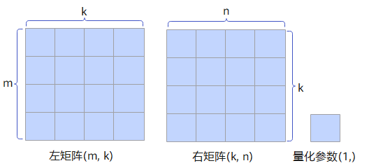
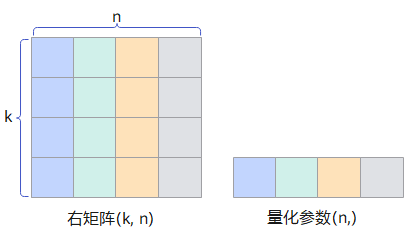
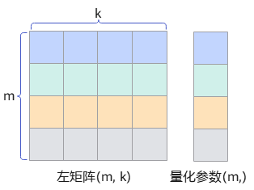
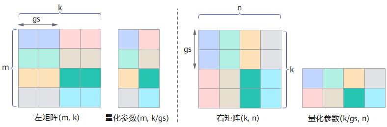
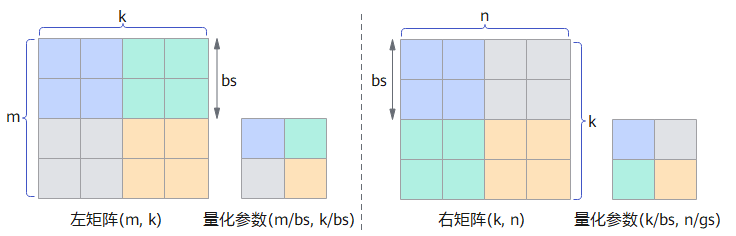

# 量化介绍

量化广泛应用于深度学习模型中，特别是在推理过程中。通过量化，模型可以在硬件上更高效地运行，减少计算资源的消耗和加速推理过程，同时降低模型的存储需求。

CANN算子量化是指对神经网络中Matmul等矩阵（cube）类算子的输入Tensor从高bit到低bit转换的计算过程，同时生成对应的量化参数scale。当低bit的cube计算完成后，可通过量化参数scale将低bit数值转换回高bit数值，从而保证整体计算结果的正确性（效果与直接用高bit计算近似等价），并有效提升计算效率。

- 静态量化：使用预先确定的量化参数进行量化。推理场景下对权重weight的量化一般采用静态量化，量化算子性能会更好些。
- 动态量化：使用输入数据在线计算量化参数进行量化。推理场景下对激活activation的量化一般采用动态量化，更能适应数据的变化，精度更高；训练场景下为了提升量化精度，也一般采用动态量化。注意，动态量化因为在线生成量化参数，量化算子性能会略差些。

## 量化模式

量化模式（又称量化粒度）是指对算子的不同输入Tensor采用不同的量化计算级别，常见的量化计算模式包括：

>说明：
>
>- m、n、k变量分别表示Tensor计算的不同轴大小。
>- 左矩阵、右矩阵分别指cube算子中用于矩阵乘法计算的两个输入Tensor，一般左矩阵代表激活activation、右矩阵代表权重weight，请用户按实际情况理解和使用。

- pertensor量化（简称T量化）：量化对象既可以是左矩阵，也可以是右矩阵，每个Tensor共用一个相同的量化参数。

  假设左矩阵shape为(m, k)，右矩阵shape为(k, n)，k为reduce轴，生成量化参数的shape为(1, )。

  

- perchannel量化（简称C量化）：量化对象是右矩阵，每个channel分别使用独立的量化参数。

  假设右矩阵shape为(k, n)，k为reduce轴，生成量化参数的shape为(n, )。

  

- pertoken量化（简称K量化）：量化对象是左矩阵，每个token分别使用独立的量化参数。

  假设左矩阵shape为(m, k)，k为reduce轴，生成量化参数的shape为(m, )。

  

- pergroup量化（简称G量化）：量化对象既可以是左矩阵，也可以是右矩阵，在reduce轴上对数据分组，每组使用独立的量化参数。
  - 假设左矩阵shape为(m, k)，k为reduce轴，在k轴上分组，group size为gs，生成量化参数的shape为(m, k/gs)。
  - 假设右矩阵shape为(k, n)，k为reduce轴，在k轴上分组，group size为gs，生成量化参数的shape为(k/gs, n)。

  

- perblock量化（简称B量化）：量化对象既可以是左矩阵，也可以是右矩阵，在所有轴上对数据分块，每块使用独立的量化参数。

  - 假设左矩阵shape为(m, k)，k为reduce轴，在m、k轴上分别按(bs, bs)块对数据分组，bs为block size，生成量化参数的shape为(m/bs, k/bs)。
  - 假设右矩阵shape为(k, n)，k为reduce轴，在k、n轴上分别按(bs, bs)块对数据分组，bs为block size，生成量化参数的shape为(k/bs, n/bs)。

  

## 常见组合量化

- 全量化：一般是指对左、右矩阵均进行量化的模式，包括
  - pertensor-perchannel量化模式（简称T-C量化模式）
  - pertoken-perchannel量化模式（简称K-C量化模式）
  - pergroup-perblock量化模式（简称G-B量化模式）
  - pertensor-perchannel-pergroup量化模式（简称T-CG量化模式）
  - perblock-perblock量化模式（简称B-B量化模式）
- 伪量化：一般是指对权重矩阵（weight）进行量化的模式，包括perchannel量化模式（简称C量化模式）。
- mx量化：本质是Microscaling量化，通过动态调整缩放因子，在极低比特下（如1bit）保持模型精度。这里指pergroup-pergroup量化模式（简称G-G量化模式），是对于量化参数类型为FLOAT8_E8M0且group size为32的特例。
